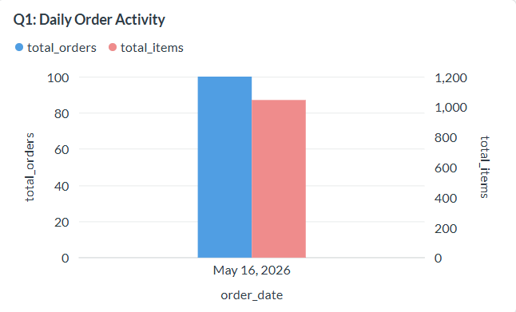
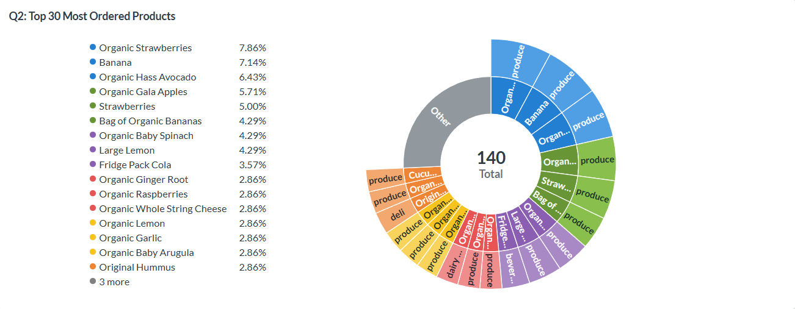
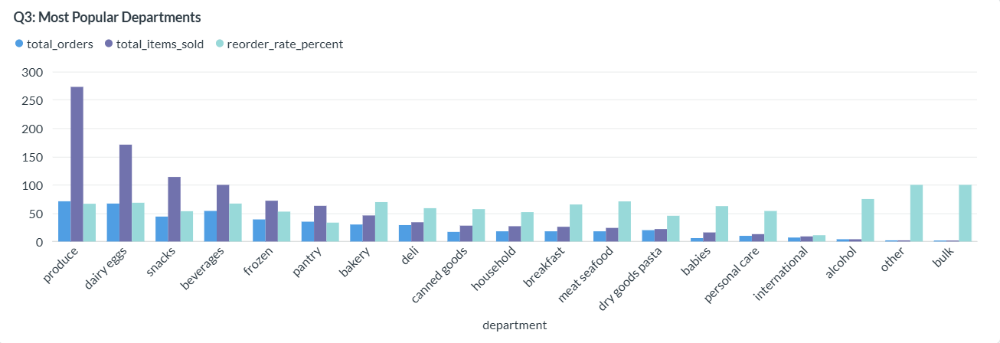
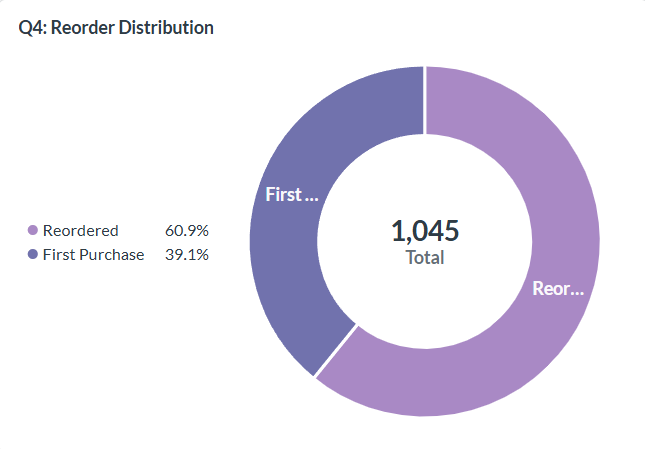
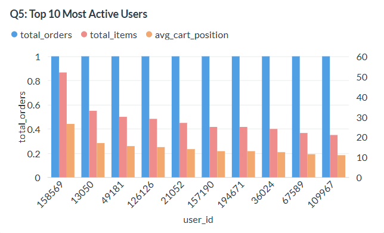
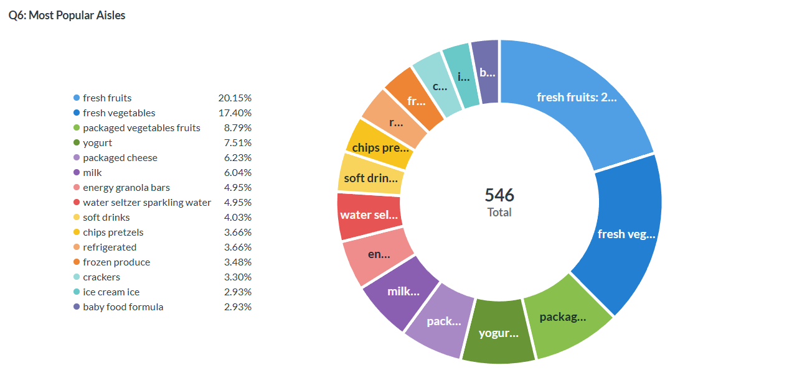
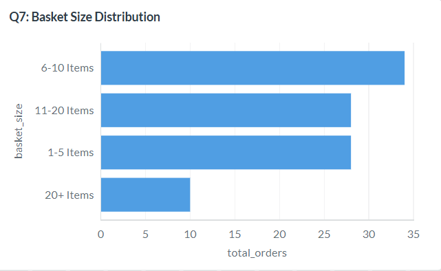
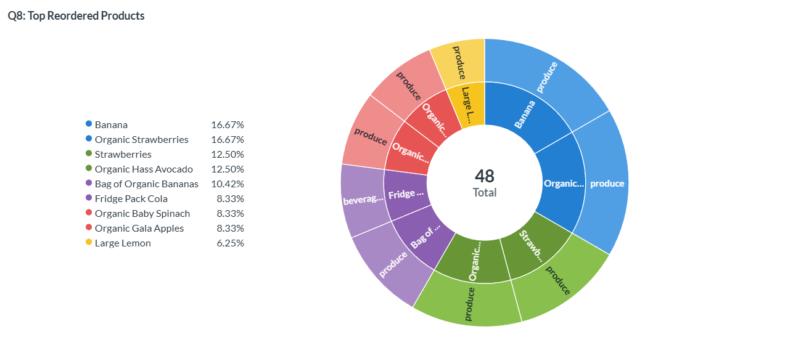
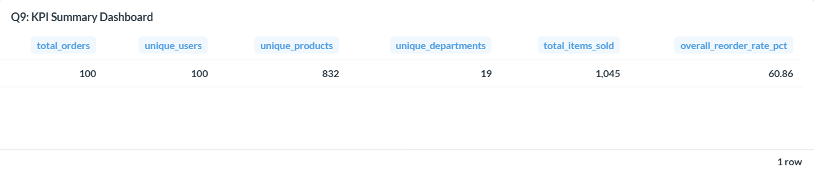
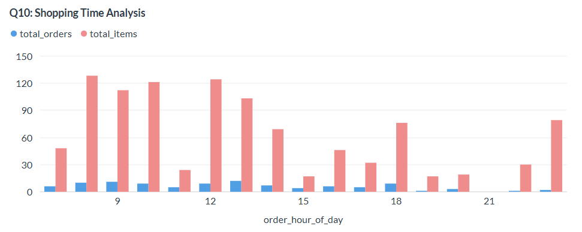

# 🚀 OPREC MCI 2026 Task 2 — Orders Data Pipeline  

> Tugas Modul 2 & 3 Lab MCI 2026 · End-to-End Modern Data Stack Implementation

---

# 👥 Anggota Kelompok 28

| Nama | NRP |
|---|---|
| Muh. Aqil Alqadri Syahid | 5025241161 |
| Kadek Andra Wikanjaya Putra | 5025241187 |

---

# Link Metabase Dashboard:
```text
http://localhost:3000/public/dashboard/b2de6533-b7a1-4213-9989-150585c81dc2
```

---

# 🧰 Technology Stack

**Pipeline Orchestration & Data Visualization**

```text
Apache Airflow → PySpark → ClickHouse → Metabase / Power BI
```

---

| Component      | Technology          | Function                                |
| -------------- | ------------------- | --------------------------------------- |
| Orchestration  | Apache Airflow      | Menjalankan dan monitoring ETL pipeline |
| Processing     | PySpark             | Transformasi dan analytics data         |
| Storage        | Parquet Data Lake   | Temporary staging layer                 |
| Data Warehouse | ClickHouse          | Penyimpanan analytical tables           |
| Visualization  | Metabase / Power BI | Dashboard dan visualisasi data          |

---

# 📋 Daftar Isi
1. **Overview**  
2. **Arsitektur Pipeline**  
3. **Penjelasan Script**  
4. **Clickhouse Schema**  
5. **Metabase Visualization**

---

# 🎯 Overview

Project ini membangun **end-to-end ETL data pipeline** menggunakan modern data stack untuk memproses dataset grocery orders berbasis API.

Pipeline melakukan:

* **Extract data dari REST API**
* **Transform nested JSON menjadi tabular dataset**
* **Simpan data ke Data Lake format Parquet**
* **Transformasi analytics menggunakan PySpark**
* **Load hasil analytics ke ClickHouse**
* **Visualisasi menggunakan Metabase dan Power BI**

Dataset berasal dari REST API:

```text
http://96.9.212.102:8000/orders
```

Dataset berbentuk **Instacart-style grocery orders** yang berisi:

- **Order transaksi**
- **Customer orders**
- **Products information**
- **Products categories**
- **reordered items**
- **Shopping behaviour**

---

# 📦 Dataset Structure

Contoh struktur data API:

```json
{
  "order_id": 718195,
  "user_id": 37056,
  "order_number": 46,
  "order_dow": 1,
  "order_hour_of_day": 15,
  "days_since_prior_order": 3,
  "products": [
    {
      "product_id": 31720,
      "product_name": "Organic Whole Milk",
      "aisle": "milk",
      "department": "dairy eggs",
      "reordered": 1
    }
  ]
}
```

---

# 🏗 Arsitektur Pipeline

```text
                ┌────────────────────┐
                │   REST API Orders  │
                │  /orders endpoint  │
                └─────────┬──────────┘
                          │
                          ▼
              fetch_orders.py (Airflow)
                          │
                          ▼
          ┌────────────────────────────────┐
          │      Data Lake (Parquet)       │
          │ data_lake/orders/*.parquet     │
          └────────────────────────────────┘
                          │
                          ▼
          process_orders_spark.py (PySpark)
                          │
        ┌─────────────────┼─────────────────┐
        │                 │                 │
        ▼                 ▼                 ▼
 orders_trending   orders_category   orders_daily_orders
    _products         _summary
                          │
                          ▼
                  ┌────────────────┐
                  │   ClickHouse   │
                  │   mci2026_db   │
                  └────────────────┘
                          │
            ┌─────────────┴─────────────┐
            ▼                           ▼
       Metabase                    Power BI
```

---

# 🌐 Akses Service

| Service | URL | Login |
|---|---|---|
| Airflow | http://localhost:8080 | admin / admin |
| Metabase | http://localhost:3000 | setup awal |
| ClickHouse HTTP | http://localhost:8123 | kelompok28 / kelompok28 |

---

# ▶️ Menjalankan Pipeline

## 1. Buka Airflow

```text
http://localhost:8080
```

## 2. Aktifkan DAG

Aktifkan DAG:

```text
mci2026_orders_pipeline
```

## 3. Trigger DAG

Klik:

```text
Trigger DAG
```

Pipeline akan menjalankan:

```text
   start
     ↓
fetch_orders
     ↓
process_orders_spark
     ↓
    end
```

---

# 📦 Penjelasan Script

# 1. fetch_orders.py

Script ini:

- mengambil data dari REST API
- melakukan parsing nested JSON
- flatten products array
- normalisasi struktur data
- menyimpan hasil ke Parquet

## Output

```text
data_lake/orders/orders_YYYYMMDD_HHMMSS.parquet
```


# 2. process_orders_spark.py

Script ini:

- membaca seluruh file parquet
- melakukan transformasi analytics menggunakan PySpark
- aggregasi data
- load hasil ke ClickHouse

## Analytics yang dibuat

| Table                    | Description            |
| ------------------------ | ---------------------- |
| orders                   | Raw transactional data |
| orders_trending_products | Produk terlaris        |
| orders_category_summary  | Analytics kategori     |
| orders_daily_orders      | Analytics harian       |


# 3. orders_pipeline.py

Airflow DAG orchestration:

```text
   start
     ↓
fetch_orders
     ↓
process_orders_spark
     ↓
    end
```

---

# 🗄 ClickHouse Schema

Database:

```sql
mci2026_db
```

## Tables

### 1. orders

Raw transactional data.

### 2. orders_trending_products

Analytics produk terlaris.

### 3. orders_category_summary

Analytics kategori produk.

### 4. orders_daily_orders

Analytics harian.

---

# 📊 Metabase Visualization

# Setup Metabase

## Add Clickhouse Database

**Database Information**:

| Field | Value |
|---|---|
| Host | clickhouse-server |
| Port | 8123 |
| Database | mci2026_db |
| Username | kelompok28 |
| Password | kelompok28 |


# 📈 Dashboard Queries & Insights

## Q1 — Daily Order Activity

Visualisasi:



## Insight

Visualisasi ini menunjukkan tren aktivitas order harian.

Insight yang dapat diperoleh:

* mengetahui hari dengan volume order tertinggi
* melihat pola kenaikan atau penurunan transaksi
* mendeteksi peak shopping activity
* mengukur pertumbuhan transaksi dari waktu ke waktu

---

## Q2: Top 30 Most Ordered Products

Visualisasi:



## Insight

Menampilkan produk yang paling sering dibeli customer.

Insight:

* Mengetahui produk terlaris pada platform.
* Mengidentifikasi produk dengan demand tertinggi.
* Membantu strategi inventory dan restock produk.
* Menentukan produk utama untuk promosi atau bundling.

---

## Q3 — Most Popular Departments

Visualisasi:



## Insight

Menampilkan performa setiap kategori produk.

Insight:

* Mengetahui kategori produk dengan volume penjualan terbesar.
* Mengukur tingkat loyalitas pelanggan melalui reorder rate.
* Department dengan reorder rate tinggi menunjukkan customer retention yang baik.
* Membantu menentukan fokus bisnis dan prioritas stok.

---

## Q4 — Reorder Distribution

Visualisasi:



## Insight

Membandingkan jumlah pembelian ulang (reordered) dengan pembelian pertama.

Insight:

* Mengukur customer loyalty terhadap produk.
* Persentase reorder tinggi menunjukkan produk sering dikonsumsi ulang.
* Dapat digunakan untuk analisis customer retention.
* Membantu identifikasi produk konsumsi rutin.

---

## Q5 — Top 10 Most Active Users

Visualisasi:



## Insight

Menampilkan user dengan aktivitas transaksi tertinggi.

Insight:

* Mengidentifikasi pelanggan paling aktif.
* Mengetahui perilaku heavy users.
* Dapat digunakan untuk loyalty program atau segmentation.
* Membantu analisis customer value dan engagement.

---

## Q6 — Most Popular Aisles

Visualisasi:



## Insight

Menganalisis aisle/rak produk yang paling sering dikunjungi melalui pembelian.

Insight:

* Mengetahui area produk paling populer.
* Membantu memahami preferensi konsumen.
* Menentukan aisle dengan demand tertinggi.
* Dapat digunakan untuk strategi penempatan produk dan promosi.

---

## Q7 — Basket Size Distribution

Visualisasi:



## Insight

Menganalisis distribusi jumlah item dalam setiap order.

Insight:

* Mengetahui kebiasaan belanja user.
* Mengidentifikasi apakah mayoritas user membeli sedikit atau banyak item.
* Basket size besar dapat menunjukkan high-value customer.
* Membantu strategi cross-selling dan bundling.

---

## Q8 — Top Reordered Products

Visualisasi:



## Insight

Menampilkan produk dengan tingkat reorder tertinggi.

Insight:

* Mengetahui produk dengan loyalitas pelanggan paling tinggi.
* Produk dengan reorder rate tinggi biasanya merupakan kebutuhan rutin.
* Membantu strategi subscription atau recurring orders.
* Dapat digunakan untuk rekomendasi produk favorit pelanggan.

---

## Q9 — KPI Summary Dashboard

Visualisasi:



## Insight

Memberikan ringkasan metrik utama dari keseluruhan dataset.

Insight:

* Total transaksi yang terjadi.
* Jumlah user unik dan produk unik.
* Banyaknya department aktif.
* Total item yang terjual.
* Tingkat reorder keseluruhan platform.

---

## Q10 — Shopping Time Analysis

Visualisasi:



## Insight

Menganalisis jam belanja paling ramai berdasarkan order.

Insight:

* Mengetahui peak hour transaksi.
* Membantu optimasi sistem saat traffic tinggi.
* Dapat digunakan untuk strategi promo berbasis waktu.
* Membantu penjadwalan operasional dan resource allocation.

---

# ✅ Hasil Pipeline

Pipeline berhasil:

- Mengambil data dari API
- Menyimpan ke data lake
- Memproses analytics menggunakan Spark
- Memuat data ke ClickHouse
- Divisualisasikan di Metabase atau Power BI
